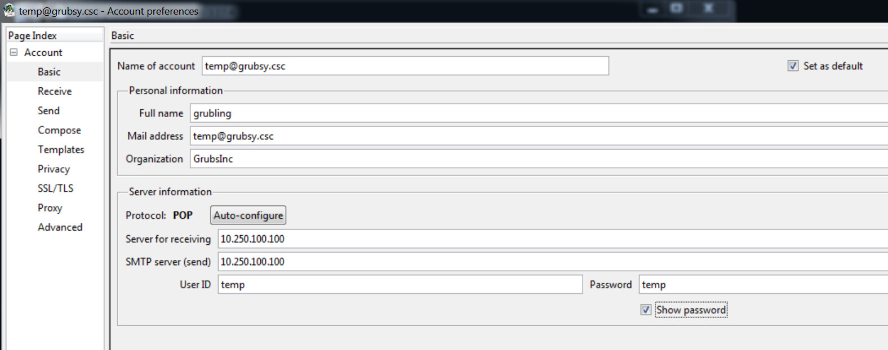
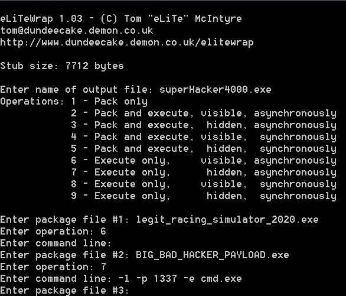

# Elitewrap

DISCLAIMER:

The techniques we use to make trojans in this lab are easily detectable by most antivirus systems and email providers. It is very easy to locate the origin of an attack with this technique. That being said, DO NOT use these tactics to attempt to gain or gain access to devices you are unauthorized to use. We are not responsible for any legal or academic trouble you get in to and will ban members for misuse if we discover these tools being used maliciously outside the scope of the controlled environment. 

## What you will need for this lab
* ``` elitewrap ```
* ``` netcat ```
* ``` a payload ```

## Procedure

1. Boot up your windows virtual machine
2. Setup Claws Mail
    - Open Claws Mail
    - Open up Configuration -> Preferences for current account...   



- Change the following to your assigned email (Example: 0@grubsy.csc)
    - ``` Name of account ```
    - ``` Mail address ```
- Change your ``` Full name ``` to something unique
- Change ``` User ID ``` and ``` password ``` to your number
    - Example:
        - User ID: 0
        - Password: 0
- Let me know if you have problems sending emails!

___


3. Navigate to the tools folder
4. Launch ``` elitewrap ```
5. Construct the trojan by packing two executables into one
    - Experiment with payload flags like ``` -e cmd.exe```
    - Experiment with ``` tftp ```
        - How could ths be used to exfiltrate data?



___

6. Email ``` grubsy@grubsy.csc ``` your trojan executable
    - Let me know when you've done this so I can run it!
7. Verify that you have remote access to the machine! (depending on how you did your payload this could differ from person to person) Feel free to craft custom scripts to run and mess around with alternate methods to create trojans (maybe hide them in PDFs or a web browser executable). Send these to other member's virtual machines or mine. If you send them to me please do not give me a payload that nukes my machine, it will be a huge pain to fix :P.

***DO NOT SEND TROJANS TO LEGIT EMAIL ADDRESSES OUTSIDE OF THE ENVIRONMENT.***